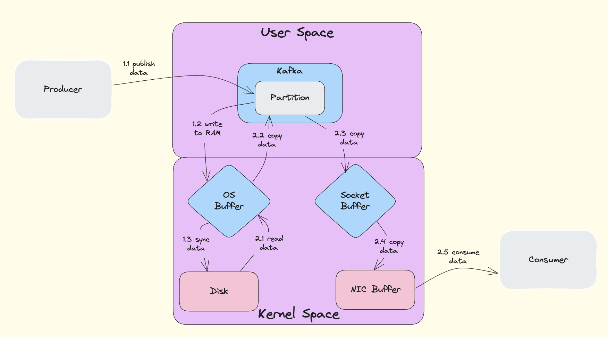
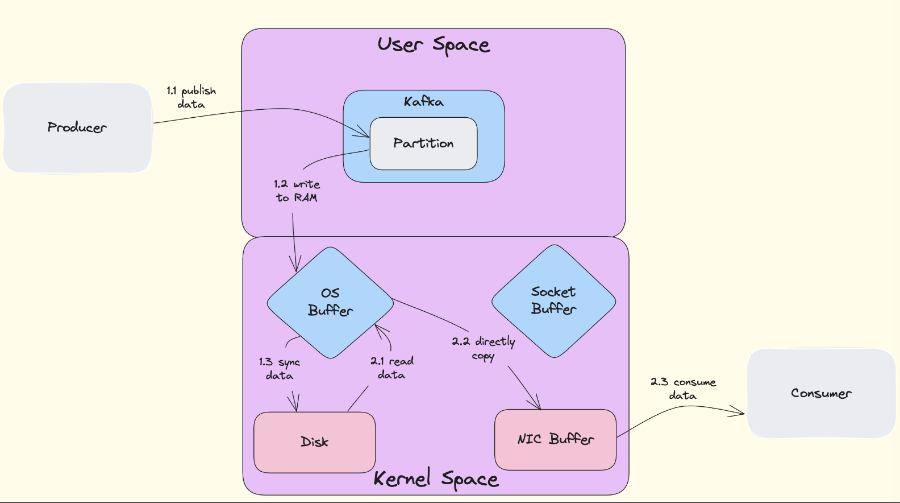

## Why is Kafka Fast

Kafka之所以能够实现如此高的性能，主要得益于两个核心技术优化：Sequential I/O（顺序I/O）和Zero Copy（零拷贝）技术。

### Sequential I/O

#### 核心原理

Kafka采用**append-only log**（仅追加日志）作为其主要数据结构。

- **append-only log**：新数据总是添加到文件的末尾
- **顺序访问模式**：这种访问模式是完全顺序的，充分利用了磁盘的物理特性

#### 性能优势

**1. 磁盘特性优化**
- 顺序读写速度远快于随机读写
- 磁盘最讨厌随机I/O（需要频繁寻址），最喜欢顺序I/O
- 顺序I/O可以让普通磁盘的读写速度接近内存访问速度

**2. 操作系统优化**
- Linux对顺序I/O有很多优化支持
- **read-ahead（预读）**：系统预测性地读取后续数据
- **write-behind（延迟写入）**：批量写入提高效率
- **页缓存利用**：有效利用操作系统的页缓存机制

**3. 具体实现**
```
Producer 生产数据 → 顺序写入磁盘文件末尾
Consumer 消费数据 → 从指定offset开始顺序读取
```

### Zero Copy

#### 什么是DMA

**DMA**全称：**Direct Memory Access**（直接内存访问）

DMA是一种数据传输技术，允许外设（如磁盘、网卡）直接访问系统内存，无需CPU参与数据搬运工作，从而解放CPU去处理其他任务。

#### Non-Zero Copy（传统方式）



**传统数据传输流程：**

**数据拷贝（4次）：**
1. **DMA拷贝**：磁盘 → 内核缓冲区
2. **CPU拷贝**：内核缓冲区 → 用户空间缓冲区
3. **CPU拷贝**：用户空间缓冲区 → 套接字缓冲区
4. **DMA拷贝**：套接字缓冲区 → 网卡

**上下文切换（4次）：**
1. **用户态 → 内核态**：`read()`系统调用
2. **内核态 → 用户态**：`read()`返回
3. **用户态 → 内核态**：`write()`系统调用
4. **内核态 → 用户态**：`write()`返回

**性能问题：**
- CPU需要参与2次数据拷贝
- 频繁的用户态和内核态切换
- 大量内存带宽消耗
- CPU缓存污染

#### Zero Copy（零拷贝）



**Zero Copy数据传输流程：**

**数据拷贝（2次）：**
1. **DMA拷贝**：磁盘 → 内核缓冲区（页缓存）
2. **DMA拷贝**：内核缓冲区 → 网卡缓冲区

**上下文切换（2次）：**
1. **用户态 → 内核态**：`sendfile()`系统调用
2. **内核态 → 用户态**：`sendfile()`返回

#### Zero Copy技术实现

**1. sendfile系统调用**
```c
// 传统方式：4次上下文切换
read(file_fd, buffer, size);     // 用户态 ↔ 内核态
write(socket_fd, buffer, size);  // 用户态 ↔ 内核态

// Zero Copy：2次上下文切换
sendfile(socket_fd, file_fd, offset, size);  // 仅一次系统调用
```

**2. Memory Mapped Files (mmap)**
- 将磁盘文件直接映射到内存中
- 避免用户空间和内核空间之间的数据拷贝
- 操作系统在适当时候将数据同步到磁盘

**3. DMA Scatter/Gather（最优实现）**
- **DMA Scatter**：磁盘 → 内核缓冲区（离散存储）
- **DMA Gather**：内核缓冲区 → 网卡（根据描述符收集数据）
- 真正的零CPU拷贝：CPU完全不参与数据搬运

#### 性能对比分析

| 方面 | 传统方式 | Zero Copy | 优化效果 |
|------|----------|-----------|----------|
| **数据拷贝次数** | 4次（2次CPU + 2次DMA） | 2次（0次CPU + 2次DMA） | **减少50%** |
| **CPU拷贝** | 2次 | 0次 | **减少100%** |
| **上下文切换** | 4次 | 2次 | **减少50%** |
| **系统调用** | 2次（read + write） | 1次（sendfile） | **减少50%** |
| **内存使用** | 需要用户缓冲区 | 无需用户缓冲区 | **节省内存** |
| **CPU使用率** | 高（参与数据拷贝） | 低（无需参与拷贝） | **显著降低** |

#### 上下文切换的性能开销

**什么是上下文切换开销？**
1. **CPU寄存器状态保存/恢复**
2. **内存页表切换**
3. **CPU缓存失效**（Cache Miss）
4. **TLB（Translation Lookaside Buffer）刷新**

**性能影响：**
- 每次上下文切换：几微秒到几十微秒
- 高并发场景下：可能占总CPU时间的20-30%

### Kafka中的应用效果

#### 实际性能表现

根据LinkedIn的基准测试：
- **峰值吞吐量**：605 MB/s
- **p99延迟**：5 ms（200 MB/s负载下）
- **三台普通机器**：每秒200万次写入

#### 技术组合优势

**1. Sequential I/O + Zero Copy**
- 顺序I/O确保磁盘写入效率最大化
- Zero Copy确保网络传输效率最大化
- CPU资源得到解放，处理其他业务逻辑

**2. 系统级优化**
- 充分利用操作系统页缓存
- 减少内存带宽消耗
- 避免CPU缓存污染
- 提高整体系统吞吐量

这就是为什么Kafka能够在普通硬件上实现如此高性能的根本原因：通过Sequential I/O充分利用磁盘特性，通过Zero Copy技术最大化网络传输效率，从而实现了系统级的性能优化。
