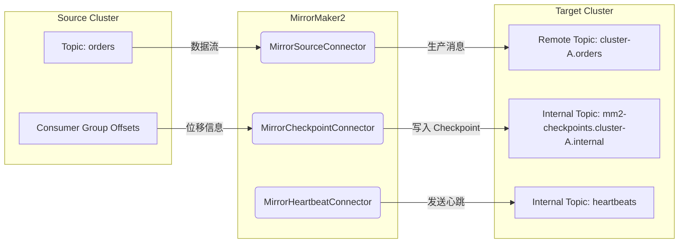

# 深入理解 Kafka MirrorMaker 2：新一代跨集群复制利器

最近，我们团队启动了一个新项目，需要从零开始搭建一套高可用的 Kafka 集群。谈到高可用，异地容灾是绕不开的话题。经过一番调研，我们最终选择了 Kafka 官方推荐的 MirrorMaker 2 (MM2) 作为我们的跨集群数据同步方案。相比于老旧的 MirrorMaker 1.x，MM2 简直是鸟枪换炮，不仅功能强大，而且运维起来也方便多了。

这篇文章就来和大家聊聊我们使用和学习 MM2 的一些心得，希望能帮助你更好地理解这个强大的工具。

## MirrorMaker 2 架构：不止是一个工具，更是一个框架

首先要颠覆一个认知：MirrorMaker 2 不是一个简单的脚本，它是一个基于 **Kafka Connect 框架**构建的独立应用。这意味着它继承了 Kafka Connect 的所有优点：高可用、可扩展、易于管理和监控。

MM2 的核心是由一系列协同工作的 **Connectors** 组成的，主要包括四个：

1.  **`MirrorSourceConnector`**：这是数据同步的主力军。它负责从源集群（Source Cluster）消费消息，并将其生产到目标集群（Target Cluster）。
2.  **`MirrorCheckpointConnector`**：这是"消费位移"的同步官。它负责将源集群中的消费者组（Consumer Group）的消费位移（Offset）同步到目标集群，并以检查点（Checkpoint）的形式记录下来。这对于实现消费者应用的容灾切换至关重要。
3.  **`MirrorHeartbeatConnector`**：这是"健康监测员"。它会定期在源集群和目标集群之间发送心跳消息（写入统一命名的内部 Topic `heartbeats`），用于监控两个集群之间的连接状态和端到端的数据同步延迟。
4.  **`MirrorSinkConnector`**：这是"回流/聚合专家"。当你需要把某个远程主题再写回本地集群、或在聚合集群中汇总多源数据时，就需要它登场；和 `MirrorSourceConnector` 的方向恰好相反。

## 工作原理揭秘

理解了 MM2 的组件构成，我们再来看看它是如何协同工作的。

### 1. 远程主题（Remote Topics）

这是 MM2 最核心也最巧妙的设计。为了防止源集群和目标集群的 Topic 命名冲突，并清晰地标识数据来源，MM2 在将数据同步到目标集群时，会自动为 Topic 名称加上源集群的前缀。

例如，源集群 `cluster-A` 中有一个名为 `orders` 的 Topic，当它被同步到目标集群 `cluster-B` 时，会自动创建一个名为 `cluster-A.orders` 的新 Topic。这个 `cluster-A.orders` 就被称为"远程主题"。

这种机制带来了几个好处：
*   **避免命名冲突**：彻底解决了两个集群中可能存在的同名 Topic 问题。
*   **清晰的数据流向**：任何消费者或管理员都能一眼看出这个 Topic 的数据源自何处。
*   **支持复杂拓扑**：为实现双向同步（Active-Active）或多对一的聚合（Fan-in）等复杂场景提供了可能。

### 2. 消费位移同步（Offset Sync）

想象一个场景：你的应用正在源集群 `cluster-A` 上消费数据，突然 `cluster-A` 挂了。你希望应用能无缝切换到灾备集群 `cluster-B`，并从上次中断的地方继续消费，而不是从头开始。

`MirrorCheckpointConnector` 就是实现这一目标的关键。它会定期将 `cluster-A` 上消费者组的位移同步到 `cluster-B` 的一个内部 Topic（名为 `mm2-checkpoints.cluster-A.internal`）中。当你的应用切换到 `cluster-B` 后，可以通过 MM2 提供的工具类或逻辑，将这些位移"翻译"成 `cluster-B` 上对应的远程主题的位移，从而实现无缝续消费。

> ⚙️ **延伸说明**：在同一复制链路中，MM2 还会自动维护另一张内部表 `offset-syncs.cluster-A-to-cluster-B.internal`，用来记录 *source offset* → *target offset* 的对应关系。`MirrorClient#translateOffsets()` 会先读取 checkpoint，再结合这张映射表完成最终转换，两张表缺一不可。

### 3. 工作流图

通过下面这张图，可以更直观地理解 MM2 的工作流程：



## 核心配置参数详解

MM2 的配置非常灵活，但初次接触可能会有点懵。这里我们重点解释几个最重要的参数。当你贴出你的配置文件后，我可以给出更具体的分析。

```properties
# properties
# 定义集群别名和连接地址
clusters = cluster-A, cluster-B
cluster-A.bootstrap.servers = kafka-a-1:9092,kafka-a-2:9092
cluster-B.bootstrap.servers = kafka-b-1:9092,kafka-b-2:9092

# 启用从 A 到 B 的复制
cluster-A->cluster-B.enabled = true

# 要复制的 Topic (支持正则表达式)
cluster-A->cluster-B.topics = .*

# 是否同步 Topic 的配置 (分区数、副本数等)
sync.topic.configs.enabled = true

# 是否同步消费组位移
sync.group.offsets.enabled = true

# 远程主题的命名规则策略
replication.policy.class = org.apache.kafka.connect.mirror.DefaultReplicationPolicy

# **权限与刷新相关**
sync.topic.acls.enabled = true                # 同步 Topic ACL
refresh.topics.interval.seconds = 60          # 定时刷新 Topic 信息
refresh.groups.interval.seconds = 60          # 定时刷新 Group 信息
refresh.cluster.configs.interval.seconds = 300# 定时刷新集群级配置

# MM2 内部 Topic 的副本数，生产环境务必设置为 >= 3
checkpoints.topic.replication.factor = 3
heartbeats.topic.replication.factor = 3
offset-syncs.topic.replication.factor = 3
```

**重点参数说明:**

*   `clusters`: 这是给你的 Kafka 集群起个别名，方便在后续配置中引用。
*   `source->target.enabled`: 这是一个方向性的配置，`cluster-A->cluster-B.enabled = true` 表示启用从 A 到 B 的数据同步。如果想实现双向同步，再加一条 `cluster-B->cluster-A.enabled = true` 即可。
*   `topics`: 控制需要同步的 Topic 列表，支持正则表达式，非常灵活。`.*` 表示同步所有。
*   `sync.group.offsets.enabled`: 是否开启消费组位移同步，如果你的消费者应用需要做容灾切换，这个必须开启。
*   `sync.topic.acls.enabled`: 是否同步 Topic 级 ACL，双活或灾备场景通常需要打开。
*   `refresh.*.interval.seconds`: 控制 Topic / Group / Cluster 配置的刷新频率；当源端动态扩容分区或变更 ACL 时，确保目标端能及时跟进。
*   `replication.policy.class`: 定义远程主题的命名规则，默认就是 `源集群名.Topic名` 的策略。一般不需要修改。
*   **内部 Topic 的副本数**: MM2 会创建一些内部 Topic 来存储心跳和检查点信息。在生产环境中，为了保证 MM2 自身的高可用，这些内部 Topic 的副本数（`replication.factor`）一定要设置为一个安全的值（比如 3）。
*   **ByteArrayConverter**：若希望消息"按字节"无损复制，请在 Worker 级别设置 `key.converter` / `value.converter` 为 `org.apache.kafka.connect.converters.ByteArrayConverter`。

## 总结

MirrorMaker 2 是一个功能强大且设计精良的工具，它通过利用 Kafka Connect 框架，提供了一个可靠、可扩展的跨集群数据复制解决方案。其独特的远程主题和位移同步机制，不仅解决了老版本 MirrorMaker 的诸多痛点，也为构建复杂的 Kafka 数据架构（如多活、聚合、云迁移等）提供了坚实的基础。

希望这篇介绍能让你对 MirrorMaker 2 有一个更清晰的认识。如果你准备在项目中使用它，强烈建议深入阅读官方文档，并进行充分的测试。

## 实战注意事项与最佳实践

* **分区一致性**：MM2 创建远程主题时会复制 *当前* 分区数；若后期在源端扩容，需要依赖 `refresh.topics.interval.seconds` 触发分区同步，否则目标端写入会失败。
* **循环复制保护**：MM2 遇到已经包含目标集群别名的 Topic 会自动跳过，防止 `A.topic` ➜ `B.A.topic` 的递归复制。
* **Exactly-Once 语义**：当前版本尚未支持 EOS，可能出现重复消息；金融级场景需在消费侧去重或等待后续 KIP-618 落地。
* **部署模式四选一**：独立 MM2 集群、接入现有 Connect Distributed、Connect Standalone、Legacy 脚本。测试/生产环境可按规模和运维偏好选择。
* **Converter 选择**：默认 String/Avro 等 Converter 会对消息进行序列化/反序列化；若仅做镜像，推荐使用 ByteArrayConverter 保证"所见即所得"。
* **部署地理考虑**：MirrorMaker 2 节点最好与**目标集群**位于同一可用区或至少网络延迟较低的机房。原因在于 MirrorSourceConnector 在写入目标集群时扮演 *Producer* 角色，而 Producer 对高延迟或抖动的网络更为敏感；相比之下从源端消费的 *Consumer* 一侧对延迟容忍度更高。
