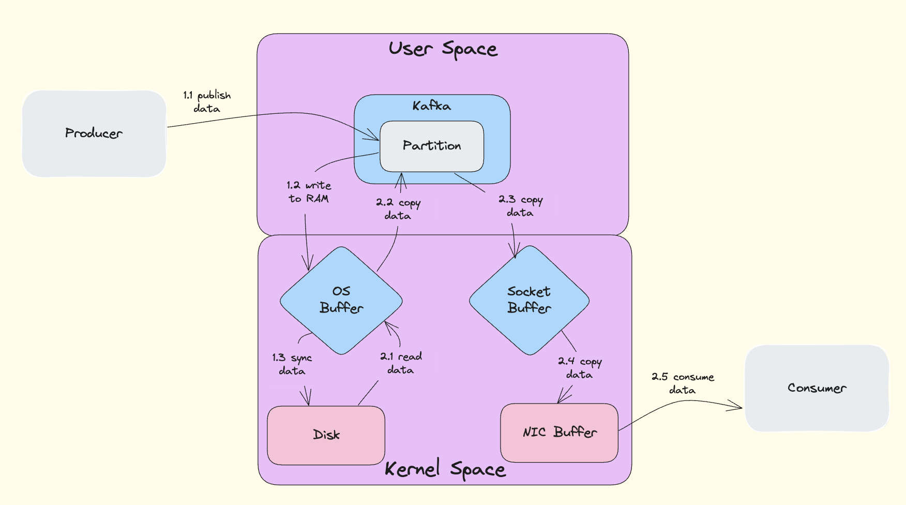

## Why is Kafka Fast

Kafka's exceptional performance can be attributed to two core technical optimizations: Sequential I/O and Zero Copy technology.

### Sequential I/O

#### Core Principles

Kafka employs **append-only log** as its primary data structure.

- **append-only log**: New data is always added to the end of the file
- **Sequential access pattern**: This access pattern is completely sequential, fully leveraging the physical characteristics of disks

#### Performance Advantages

**1. Disk Characteristics Optimization**
- Sequential read/write is much faster than random read/write
- Disks hate random I/O (requiring frequent seeking) but love sequential I/O
- Sequential I/O can make ordinary disk read/write speeds approach memory access speeds

**2. Operating System Optimization**
- Linux provides extensive optimization support for sequential I/O
- **read-ahead**: System predictively reads subsequent data
- **write-behind**: Batch writing improves efficiency
- **Page cache utilization**: Effectively leverages the operating system's page cache mechanism

**3. Implementation Details**
```
Producer generates data → Sequential write to end of disk file
Consumer consumes data → Sequential read from specified offset
```

### Zero Copy

#### What is DMA

**DMA** stands for: **Direct Memory Access**

DMA is a data transfer technology that allows peripherals (such as disks, network cards) to directly access system memory without CPU involvement in data movement, thereby freeing the CPU to handle other tasks.

#### Non-Zero Copy (Traditional Approach)



**Traditional Data Transfer Process:**

**Data Copies (4 times):**
1. **DMA copy**: Disk → Kernel buffer
2. **CPU copy**: Kernel buffer → User space buffer
3. **CPU copy**: User space buffer → Socket buffer
4. **DMA copy**: Socket buffer → Network card

**Context Switches (4 times):**
1. **User mode → Kernel mode**: `read()` system call
2. **Kernel mode → User mode**: `read()` returns
3. **User mode → Kernel mode**: `write()` system call
4. **Kernel mode → User mode**: `write()` returns

**Performance Issues:**
- CPU must participate in 2 data copies
- Frequent user mode and kernel mode switching
- Heavy memory bandwidth consumption
- CPU cache pollution

#### Zero Copy


**Zero Copy Data Transfer Process:**

**Data Copies (2 times):**
1. **DMA copy**: Disk → Kernel buffer (page cache)
2. **DMA copy**: Kernel buffer → Network card buffer

**Context Switches (2 times):**
1. **User mode → Kernel mode**: `sendfile()` system call
2. **Kernel mode → User mode**: `sendfile()` returns

#### Zero Copy Technology Implementation

**1. sendfile System Call**
```c
// Traditional approach: 4 context switches
read(file_fd, buffer, size);     // User mode ↔ Kernel mode
write(socket_fd, buffer, size);  // User mode ↔ Kernel mode

// Zero Copy: 2 context switches
sendfile(socket_fd, file_fd, offset, size);  // Only one system call
```

**2. Memory Mapped Files (mmap)**
- Map disk files directly into memory
- Avoid data copying between user space and kernel space
- Operating system synchronizes data to disk at appropriate times

**3. DMA Scatter/Gather (Optimal Implementation)**
- **DMA Scatter**: Disk → Kernel buffer (scattered storage)
- **DMA Gather**: Kernel buffer → Network card (collect data based on descriptors)
- True zero CPU copy: CPU completely uninvolved in data movement

#### Performance Comparison Analysis

| Aspect | Traditional Approach | Zero Copy | Optimization Effect |
|--------|---------------------|-----------|-------------------|
| **Data Copy Count** | 4 times (2 CPU + 2 DMA) | 2 times (0 CPU + 2 DMA) | **50% reduction** |
| **CPU Copy** | 2 times | 0 times | **100% reduction** |
| **Context Switches** | 4 times | 2 times | **50% reduction** |
| **System Calls** | 2 times (read + write) | 1 time (sendfile) | **50% reduction** |
| **Memory Usage** | Requires user buffer | No user buffer needed | **Memory saving** |
| **CPU Utilization** | High (participates in copying) | Low (no copying involvement) | **Significantly reduced** |

#### Context Switching Performance Overhead

**What constitutes context switching overhead?**
1. **CPU register state save/restore**
2. **Memory page table switching**
3. **CPU cache invalidation** (Cache Miss)
4. **TLB (Translation Lookaside Buffer) flushing**

**Performance Impact:**
- Each context switch: Several microseconds to tens of microseconds
- In high-concurrency scenarios: May account for 20-30% of total CPU time

### Application Effects in Kafka

#### Actual Performance Results

According to LinkedIn's benchmark tests:
- **Peak throughput**: 605 MB/s
- **p99 latency**: 5 ms (under 200 MB/s load)
- **Three ordinary machines**: 2 million writes per second

#### Technology Combination Advantages

**1. Sequential I/O + Zero Copy**
- Sequential I/O ensures maximum disk write efficiency
- Zero Copy ensures maximum network transmission efficiency
- CPU resources are freed to handle other business logic

**2. System-level Optimization**
- Fully utilizes operating system page cache
- Reduces memory bandwidth consumption
- Avoids CPU cache pollution
- Improves overall system throughput

This is why Kafka can achieve such high performance on ordinary hardware: by fully leveraging disk characteristics through Sequential I/O and maximizing network transmission efficiency through Zero Copy technology, achieving system-level performance optimization. 